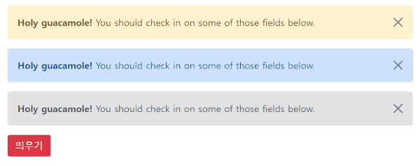

# 2. 동적 UI 만드는 스텝 (Alert 박스 만들기)

[ 오늘의 숙제 ]

Alert 박스 내에 닫기 버튼과 기능을 만들어보십시오

닫기 버튼을 누르면 Alert 박스가 뿅 사라져야합니다.



▲ 오늘은 이런 Alert UI를 만들어보면서 html 변경이나 더 해봅시다.

## 기본적인 UI 만드는 법칙

웹페이지에선 탭, 모달창, 서브메뉴, 툴팁 등 수백개의 동적인 UI를 만들 수 있습니다.

이런거 하나하나 다 가르치면 100강도 모자라기 때문에

UI 만드는 법을 알려드릴테니 이거 외워가시면 저런 UI는 알아서 다 만들 수 있습니다.

1. HTML CSS 로 미리 UI 디자인을 해놓고 필요하면 평소엔 숨김

2. 버튼을 누르거나할 경우 UI를 보여달라고 자바스크립트 코드짬

이게 다임

> ## Step 1. Alert UI 디자인부터 하기

작업폴더에 main.css 이런거 하나 만들고

index.html `<head>` 태그 안에 `<link href="main.css" rel="stylesheet">` 이렇게 첨부하면 css 이용가능합니다.

html 파일에는

```html
<div class="alert-box">알림창임</div>
```

css 파일에는

```css
.alert-box {
  background-color: skyblue;
  padding: 20px;
  color: white;
  border-radius: 5px;
  display: none;
}
```

추가하면 디자인 완성입니다.

UI를 평소에 숨기고 싶으면 `display : none` 주면 됩니다.

다시 보여주고 싶으면 `display : block` 넣으면 보입니다.

싫으면 `visibility : hidden` 이것도 있습니다.

> ## Step 2. 버튼 누르면 Alert UI 보여주기

거의 모든 html 태그 내에 onclick 이라는 속성을 넣을 수 있는데

이걸 넣게되면 해당 html 을 클릭시 onclick 안의 자바스크립트를 실행해줍니다.

그럼 버튼을 눌렀을 때 자바스크립트를 실행하고 싶으면

```html
<button onclick="자바스크립트~~">버튼</button>
```

이렇게 코드짜면 되는 것임

```html
<button onclick="Alert 박스 보여주셈~~">버튼</button>
```

`onclick` 속성 안에 이렇게 코드짜면 버튼누르면 Alert 박스가 보이지않을까요?

근데 `"Alert 박스 보여주셈~"` 이렇게 사람처럼 말하면 컴퓨터는 절대 못알아듣는다고 했습니다.

컴퓨터 바보 멍청이임

정확히 어떤걸 어떻게 수정해야 박스가 보일까요?

그냥 알려드리면 `display : block` 이렇게 수정하면 Alert 박스가 보입니다.

5분 드릴테니 빨리 자바스크립트 짜보십시오

그렇다면 집에가서 상단 숙제를 해옵시다.

> ## 숙제 답

```html
<!DOCTYPE html>
<html lang="ko">
  <head>
    <meta charset="UTF-8" />
    <meta name="viewport" content="width=device-width, initial-scale=1.0" />
    <title>JavaScript</title>
    <link rel="stylesheet" href="css/styles.css" />
  </head>
  <body>
    <div class="alert-box">
      알림창임
      <button class="close-button">X</button>
    </div>
    <button class="open-button">버튼</button>
    <script src="js/app.js"></script>
  </body>
</html>
```

```css
.alert-box {
  background-color: skyblue;
  padding: 20px;
  color: white;
  border-radius: 5px;

  justify-content: space-between;
  align-items: center;
}

button {
  border: none;
}

.close-button {
  background-color: skyblue;
  font-size: 16px;
  color: gray;

  height: 20px;
  width: 20px;
}

.close-button:hover {
  color: black;
  cursor: pointer;
}

.open-button {
  background-color: tomato;
  height: 40px;
  width: 80px;

  margin-top: 10px;

  border-radius: 5px;

  cursor: pointer;

  color: #ffffff;
}

.open-button:hover {
  background-color: rgb(255, 99, 71, 0.8);
}
```

```javascript
const alertBox = document.querySelector(".alert-box");
const openButton = document.querySelector(".open-button");
const closeButton = document.querySelector(".close-button");

function openAlertBox() {
  alertBox.style.display = "flex";
}

function closeAlertBox() {
  alertBox.style.display = "none";
}

openButton.addEventListener("click", openAlertBox);
closeButton.addEventListener("click", closeAlertBox);
```

> ## 숙제 답안지

닫기버튼 누르면 Alert 박스 닫으라고 하면 됩니다.

근데 닫으라고 명령주면 컴퓨터는 못알아들으니

`id`가 `alert` 인걸 `display : none` 이걸로 바꾸라고 코드짜면 알아들을듯요

```html
<div class="alert-box" id="alert">
  알림창임
  <button onclick="document.getElementById('alert').style.display = 'none'; ">
    닫기
  </button>
</div>
```

이러면 되겠군요

`display : none` 바꿔주는 코드를 내가 어떻게 아냐고요?

안배운건 생각한다고 나오지않습니다 당연히 구글에서 검색해봐야함
