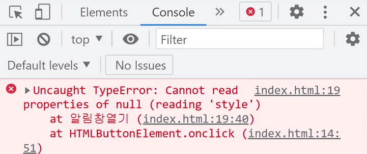
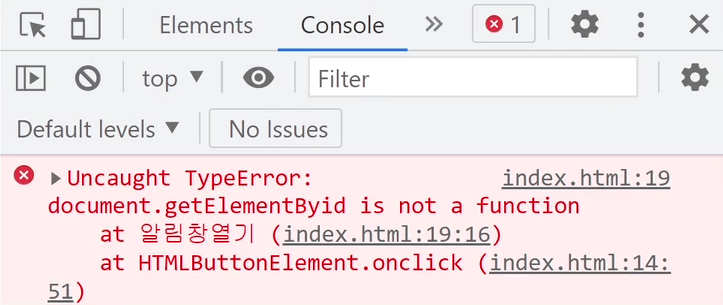

# 3. 자바스크립트 function 문법 사용법

[오늘의 숙제]

Alert 박스 닫는 코드도 function 이용해서 짧게 한 단어로 축약해보십시오

> ## 자바스크립트 function 문법

function (일명 함수) 라는 문법이 있는데

이 문법 쓰는 이유부터 알고 지나가봅시다.

함수는 **길고 더러운 코드 한 단어로 축약하고 싶을 때** 쓰는 문법입니다.

간지나는 개발자말로 표현하면 **특정 기능을 다음에도 쓰기 위해 모듈화해놓는 문법** 인데

어려우니 그냥 긴 코드 짧은 단어로 축약하고 싶을 때 쓰는 문법이라고 외우면 됩니다.

```javascript
function 자유롭게작명(){
  축약하고 싶은 긴 코드
}
```

1. `function` 키워드 쓰고 소괄호, 중괄호 붙이면 됩니다.

2. 그리고 소괄호 왼쪽에 작명하고

3. 긴 코드를 중괄호 안에 담으면 코드 축약 끝입니다.

그럼 이제 `자유롭게작명()` 이거 쓸 때 마다 그 자리에 긴 코드가 실행됩니다.

진짜임 실험해보셈

> ## Alert 여는 코드 function으로 축약해보기

버튼의 onclick 안에 길고 더럽게 자바스크립트 코드가 있었는데

그걸 함수 문법을 이용하면 좀 짧게 축약해서 쓸 수도 있겠군요.

```html
<button onclick="알림창열기()">알림창 여는 버튼</button>

<script>
  function 알림창열기() {
    document.getElementById("alert").style.display = "block";
  }
</script>
```

Alert 여는 코드를 `function` 안에 넣어봤습니다.

그럼 이제 `알림창열기()` 라고 쓸 때 마다 `function` 안에 있는 긴 코드가 실행됩니다.

그래서 버튼 `onclick` 안에 예전처럼 길게 코드 안짜도 됩니다. 단어하나 적으면 끝임

(참고)

함수 이름을 영어로 작명할 때

- 영어소문자로 시작합니다.

- `open_alert()` 이런거 안됩니다. `openAlert()` 이렇게 붙여서 쓰는게 자바스크립트 관습입니다. (일명 camelCase)

- 한글작명도 상관없긴합니다.

> ## 자주 겪는 에러들 1. JS 코드는 밑에 짜야합니다

자바스크립트는 html 조작하는 언어라고 했습니다.

근데 조작할 html이 위쪽에 있어야 조작이 잘 됩니다.

자바스크립트를 조작할 html 위에 작성하면 안됩니다.

왜냐면 컴퓨터가 html 파일을 읽을 때 위에서 부터 한줄한줄 읽는데

미리 html을 읽어놔야 조작이 가능하기 때문입니다.

> ## 자주 겪는 에러들 2. 오타주의

셀렉터 이런거 맨날 오타납니다.

`getElementById()` 인데 `i`를 소문자로 쓴다든지 그런 경우도 많고

아니면 `getELementById('alert1111')` 처럼 잘못된 `id`를 찾고 있거나 그럴 수도 있습니다.

다행히 이상하게 코드짜면 에러가 나는데

에러메세지는 브라우저 개발자도구 Console 탭에 들어가면 나옵니다.

브라우저에서 우클릭 - 검사 - Console탭 눌러보십시오



▲ 여기에 `Cannot read properties of null` 어쩌구 라는 에러가 나오면

`alert111` 이런 식으로 `id` 이름이 잘못되었다는 뜻입니다.



▲ `~~ is not a function` 은 함수명이 잘못되었다는 뜻입니다.

`getElementById()` 이것도 소괄호 붙는거 보니까 함수인데

여기에 오타났다는 뜻입니다.

아무튼 오타났다고 알려주는 고마운 메세지니까 이거 보고 "디버깅" 이란걸 해나가면 됩니다.

버그없애는걸 디버깅이라고 합니다.

실은 에러메세지 그대로 구글 찾아보는것도 빠름

(오늘의 결론)

function 문법 생김새만 외운다고 공부 끝이 아니라

나중에 혼자서도 코드짜고 싶으면 용도를 잘 외우고 지나가면 되겠습니다.

function 왜, 언제 쓴다고 했습니까

그걸 알면 이제 자유자재로 function 활용가능한 것임

이제 숙제나 하러갑시다
