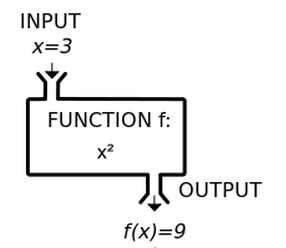

# function의 파라미터 문법

[오늘의 숙제]

버튼 2개를 만들어놓고

버튼1과 버튼2를 누르면 각각 다른 이름의 alert 박스가 나오도록 코드를 짜봅시다.

- 버튼1을 누르면 '아이디를 입력하세요' 라는 alert 박스가 등장해야합니다.

- 버튼2를 누르면 '비밀번호를 입력하세요' 라는 alert 박스가 등장해야합니다.

> ## 저번시간 숙제

닫기버튼의 자바스크립트 코드를 함수로 축약해보라고 했습니다.

```html
<button onclick="알림창닫기()">닫기</button>
<script>
  function 알림창닫기() {
    document.getElementById("alert").style.display = "none";
  }
</script>
```

> ## function에 사용가능한 파라미터 문법

파라미터라고 하면 어려우니까 구멍이라고 합시다.

함수내에 구멍을 뚫어줄 수 있습니다.

```javascript
function 알림창열기(구멍) {
  document.getElementById("alert").style.display = 구멍;
}
```

지금 함수 내에 구멍을 뚫었습니다.

구멍을 뚫는 법은

1. () 소괄호 내에 아무 글자나 적고

2. {} 중괄호 내에도 같은 글자 아무데나 적으면 됩니다.

구멍을 왜 뚫냐고요?

-> 구멍을 뚫으면 함수를 업그레이드해서 사용할 수 있습니다.

구멍이 뚫려있으면 이제 함수를 쓸 때 그냥 쓰는게 아니라

소괄호 내에 뭔가 문자나 숫자등을 입력해서 사용가능합니다.

```javascript
function 알림창열기(구멍) {
  document.getElementById("alert").style.display = 구멍;
}

알림창열기("안녕");
알림창열기("바보");
```

▲ 업그레이드 된 함수를 사용할 때는

소괄호 구멍자리에 뭔가 내가 원하는 문자를 입력해줄 수 있습니다.

문자를 입력하면 아까 그 {} 중괄호 내부의 '구멍'자리에 문자가 쇼옥하고 들어가게 됩니다.

그럼 `알림창열기('안녕')` 이렇게 실행하면

`document.getElementById('alert').style.display = '안녕';`

이런 코드가 실행된다는 것입니다.

```javascript
function 알림창열기(구멍) {
  document.getElementById("alert").style.display = 구멍;
}

알림창열기("none"); //이거 실행하면 알림창열릴듯
알림창열기("block"); //얘는 닫힐듯
```

▲ 좀 더 실용적인 사용예시를 들고왔습니다.

`알림창열기('block')` 이렇게 실행하면

`document.getElementById('alert').style.display = 'block';` 이런 코드가 실행됩니다.

그럼 알림창이 열리겠군요

`알림창열기('none')` 이렇게 실행하면

`document.getElementById('alert').style.display = 'none';` 이런 코드가 실행됩니다.

그럼 알림창이 열리겠군요

이렇게 하면 아까처럼 함수 2개나 만들 필요가 없어지겠죠?

> ## 이거 구멍 문법을 어디다 쓰죠?

문법만 외우고 땡이 아니라

언제 이 문법을 써야하는지 알아야 나중에 혼자서도 코드 잘짭니다.

아까는 `알림창열기()` `알림창닫기()` 두 개의 함수를 만들어 썼지만

지금은 `알림창열기(구멍)` 이거 하나면 다 됩니다.

-> 그래서 비슷한 함수가 여러개 있으면 굳이 여러개 만들 필요 없이 하나가지고 구멍만 뚫어보십시오.

함수 하나가지고 다양한 기능을 실행할 수 있게 됩니다.

이거 외엔 쓸데없습니다

> ## 파라미터 문법 이해를 위한 예시 2

```javascript
function plus() {
  2 + 1;
}
```

코드를 짜다가 2 + 1 같은 어렵고 복잡한 수식을 함수로 축약해서 사용하고 있습니다.

근데 갑자기 2 + 2 도 필요하고 2+ 3 도 필요한 겁니다.

그럼 어떻게하죠?

```javascript
function plus() {
  2 + 1;
}

function plus2() {
  2 + 2;
}

function plus3() {
  2 + 3;
}
```

이렇게 하면 될듯요

근데 비슷한 함수들은 굳이 많이 만들 필요없습니다.

구멍 문법이 있기 때문입니다.

```javascript
function plus(구멍) {
  2 + 구멍;
}
```

가변적인 부분을 구멍뚫어주면

이제 함수 쓸 때 마다

plus(1) 하면 2 + 1 해주고

plus(2) 하면 2 + 2 해주니까

함수 하나로 해결가능합니다.

그래서 쓰는 문법이 구멍문법입니다.

> ## 파라미터 문법 특징

이제 쪽팔리니까 구멍말고 파라미터라고 합시다.

파라미터 문법 세부사항 2개가 있는데

1. 파라미터는 자유롭게 작명가능합니다.

```javascript
function plus(a) {
  2 + a;
}
```

2. 파라미터는 2개 이상 사용가능합니다.

```javascript
function plus(a, b) {
  a + b;
}
plus(2, 5);
```

콤마로 구분하면 됩니다.

그럼 함수 사용할 때도 자료 2개 입력가능

> ## (참고) 함수는 원래 수학에서 온건데

실은 수학시간의 함수 vs 자바스크립트의 함수는 둘 다 같은 역할을 합니다.

중학교 수학시간을 떠올려봅시다. 이런거 배웠을 걸요

```javascript
f(x) = x + 1 일때
f(3)은 뭘까요? -> 4임
f(5)는 뭘까요? -> 6임
```

`x`를 구멍으로 바꾸면 자바스크립트랑 똑같습니다.

실은 함수는 수학에서 "뭔가 input 넣으면 규칙에 따라 output을 출력해주는 마법의 모자" 만들 때 사용합니다.



외국에선 중학교 수학시간에 함수를 마법의 모자, 블랙박스 이렇게 비유해서 표현하곤 합니다.

자바스크립트 함수도 "구멍에 뭐 집어넣으면 규칙에 따라 각각 다른 기능 실행해주는 마법의 모자" 일 뿐입니다.

아무튼 비유하자면 그렇습니다.

집에가서 숙제나 해오십시오
