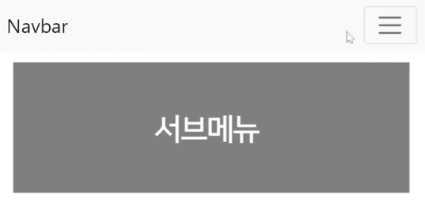

# 6. 서브메뉴 만들어보기와 classList 다루기

[오늘의 숙제]

심심하면 지금까지 썼던 셀렉터를 `querySelector`로 다 바꿔보십시오



버튼누르면 등장하는 서브메뉴를 만들며

자바스크립트로 class 탈부착하는 문법을 배워봅시다.

> ## Bootstrap 설치해서 쓸 것임

Bootstrap css 파일을 설치해놓으면

버튼, 탭, 메뉴 같은걸 복붙식으로 개발할 수 있습니다.

css 짜기 귀찮으니 설치해봅시다.

구글에 bootstrap 검색하면 나오는 맨 첫 사이트 들어가보면 되겠습니다.

그리고 get started 버튼 누르면 됩니다.

1. 우선 우측 위에서 버전이 5.X 버전인지 확인한 후에

2. css 파일은 `<head>` 태그 안에,

3. js 파일은 `<body>`태그 끝나기 전에 붙여넣으면 설치 끝입니다.

https://getbootstrap.com/docs/5.1/getting-started/introduction/#starter-template

모르겠다면 그냥 starter template 항목에 있는 예제코드로 html파일 내용을 갈아치우면 설치됩니다.

갈아치웠으면 css 파일도 `<link>`태그로 잘 넣으셈

> ## Navbar 만들기

Bootstrap을 설치해놨으면

그 사이트에서 원하는 웹 UI 검색해서 복붙하면 웹페이지 개발 끝입니다.

버튼같은거 검색해서 예제코드 붙여넣어보셈

하지만 우린 상단 메뉴부터 만들어봅시다.

상단메뉴 이름은 Navbar 입니다.

그거 하나 맘대로 복사붙여넣기 해보면 되는데

근데 그냥 이거 복사붙여넣기 하십시오

```html
<nav class="navbar navbar-light bg-light">
  <div class="container-fluid">
    <span class="navbar-brand">Navbar</span>
    <button class="navbar-toggler" type="button">
      <span class="navbar-toggler-icon"></span>
    </button>
  </div>
</nav>
```

이러면 상단바 제작 끝입니다.


그럼 이제 버튼 누르면 등장하는 서브메뉴를 만들어봅시다.

저런 UI 어떻게 만든다고 했습니까

1. 미리 html css로 디자인 해놓고 숨기든가 함

2. 버튼누르면 보여줌

이러면 끝이라 미리 디자인부터 합시다.

디자인은 그냥 Bootstrap 홈페이지에서 list group 찾아서 `<nav>`밑에 복붙하면 될듯요

```html
<ul class="list-group">
  <li class="list-group-item">An item</li>
  <li class="list-group-item">A second item</li>
  <li class="list-group-item">A third item</li>
  <li class="list-group-item">A fourth item</li>
  <li class="list-group-item">And a fifth one</li>
</ul>
```

서브메뉴의 html css 디자인 완성

> ## 하지만 이번엔 class 탈부착식으로

버튼 누르면 보여달라고 코드짭시다.

`어쩌구.style.display = 'block'`

이렇게 해도 되겠지만 지겨우니까 이번엔 `class` 탈부착식으로 구현해봅시다.

```css
.list-group {
  display: none;
}
.show {
  display: block;
}
```

css 파일 열어서 평소에 .list-group 붙은 요소는 숨겨놓도록 합시다.

그리고 거기에 show라는 클래스를 부착하면 보여주는 식으로 개발해봅시다.

이제 버튼누르면 `<ul class="list-group">` 에다가 show라는 클래스 부착하라고 코드짜면 서브메뉴 UI 완성임

왜 이따구로 class를 부착해서 만드냐고요?

나중에 display : block 말고 다른 스타일도 동시에 주고 싶을 경우 유용해서 그렇습니다.

> ## 버튼 클릭시 저기에 클래스명을 추가해주세요

버튼 눌렀을 때 show 라는 클래스를 저기에 추가해봅시다.

class명을 원하는 요소에 추가하는 법은

`셀렉터로찾은요소.classList.add('클래스명')` 이렇게 쓰면 됩니다.

class명을 원하는 요소에서 제거하는 법은

`셀렉터로찾은요소.classList.remove('클래스명')` 이렇게 쓰면 됩니다.

당연히 구글 검색해봐야 알지 생각해서 나오는 것들이 아닙니다.

```javascript
document
  .getElementsByClassName("navbar-toggler")[0]
  .addEventListener("click", function () {
    document.getElementsByClassName("list-group")[0].classList.add("show");
  });
```

▲ 그래서 `class="navbar-toggler"` 가진 요소 클릭하면

`class="list-group"`인 요소에 `show`라는 클래스명 추가하라고 코드를 짰습니다.

이제 버튼누르면 서브메뉴가 잘 보이는군요.

> ## 버튼 한 번 더 누르면 숨기기

버튼을 한 번 더 누르면 서브메뉴를 숨기고 싶은겁니다.

그럼 당연히 노예 컴퓨터에게 이렇게 명령내리면 됩니다.

"버튼 한 번 더 누르면 show 클래스를 제거해주세요"

근데 이건 나중에 if문, 변수문법을 배우면 직접 만들어볼 수 있기 때문에

좀 쉬운 방법을 먼저 알려드리자면

```javascript
document
  .getElementsByClassName("navbar-toggler")[0]
  .addEventListener("click", function () {
    document.getElementsByClassName("list-group")[0].classList.toggle("show");
  });
```

`.classList.toggle()` 쓰면

- 클래스명이 있으면 제거하고

- 클래스명이 없으면 붙여줍니다.

그래서 왔다갔다하는 UI 만들 때 유용하게 쓰면 되겠습니다.

> ## `querySelector`

`getElementById()`

`getElementsByClassName()`

이거 말고도 다른 방식으로 html 요소를 찾아주는 셀렉터도 있습니다.

`querySelector`인데 이거 쓰면 css 잘하는 분들은 편리하게 사용가능합니다.

```html
<div class="test1">안녕하세요</div>
<div id="test2">안녕하세요</div>

<script>
  document.querySelector(".test1").innerHTML = "안녕";
  document.querySelector("#test2").innerHTML = "안녕";
</script>
```

`querySelector()` 안에는 css 셀렉터 문법을 사용가능합니다.

(css에서 마침표는 `class`라는 뜻이고 `#`은 `id`라는 뜻임)

다만 `querySelector()` 는 맨 위의 한개 요소만 선택해줍니다.

```html
<div class="test1">안녕하세요</div>
<div class="test1">안녕하세요</div>

<script>
  document.querySelectorAll(".test1")[1].innerHTML = "안녕";
</script>
```

▲ 그래서 위처럼 `test1`이라는 클래스가 중복으로 여러개 있는데

X번째 요소를 선택하고 싶은 경우엔 `querySelectorAll()` 쓰면 됩니다.

`querySelectorAll()` 은 해당하는걸 다 찾아서 `[]` 안에 담아줍니다.

그래서 `[숫자]` 를 뒤에 붙여서 원하는 위치에 있는 요소 찾아쓰면 됩니다.

그래서 심심하면 지금까지 썼던 셀렉터를 `querySelector`로 다 바꿔보십시오
